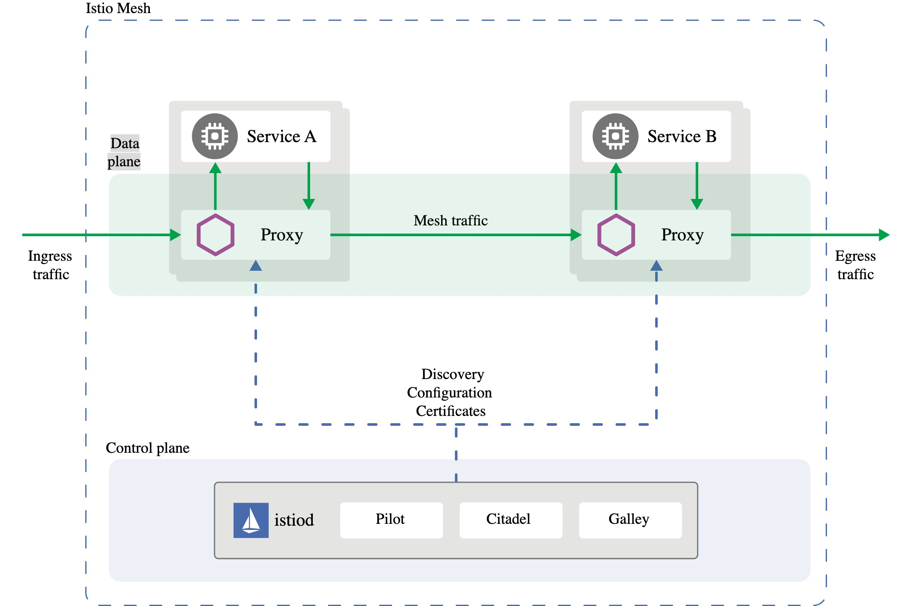
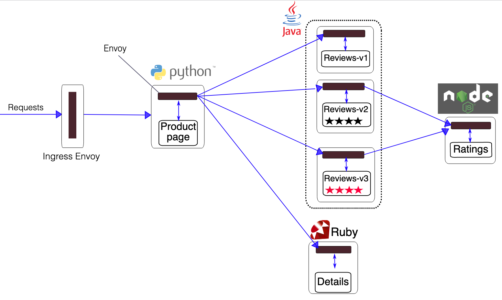
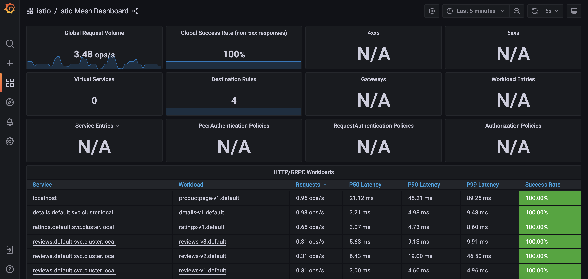
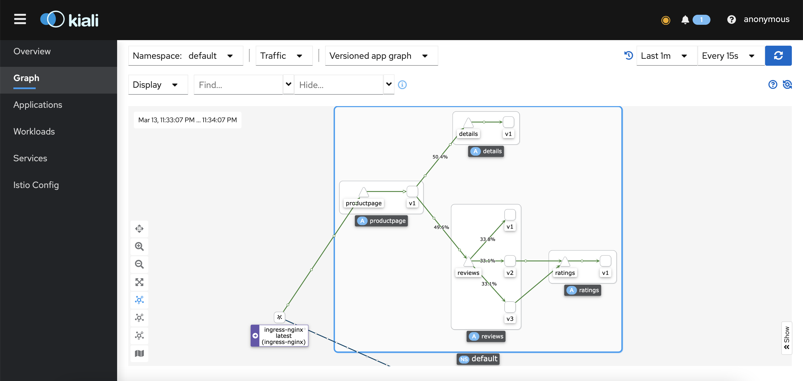
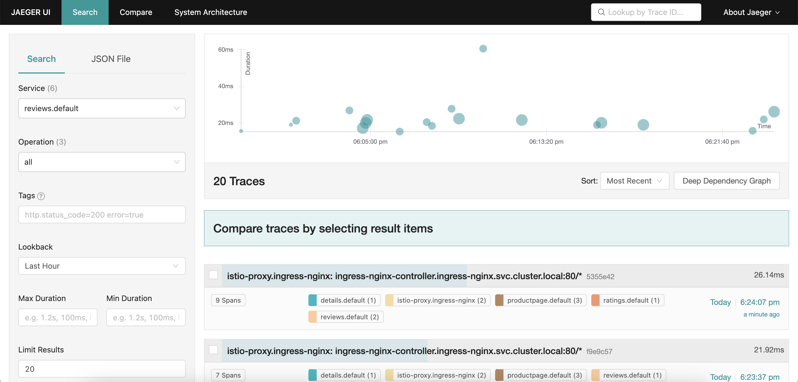

# Deploy Istio
   
  Istio is a "Service Mesh" for manage comunication between Microservices inside Kubernetes Core concept of Istio is 
   - Secure : mTLS between pod
   - Connect : Canary deployment,Retry policy,Circuit breaker
   - Observe : Monitor How traffic is flowing,connection,Response time and Tracing
   - Control : Authentication between pod   
  
  The main module in Control plane(Istiod) is
  - Pilot :  Configuration discovery (Automate inject Envoy proxy)
  - Citadel : Certificates management (mTLS between Envoy proxy)
  - Gallary : Configuration
## Table of contents
  - [Prerequisites](#prerequisites)
  - [Step 1 - Check Kubernetes cluster](#step-1---check-kubernetes-cluster)
  - [Step 2 - Install istio CLI](#step-2---install-istio-cli)
  - [Step 3 - Check istio CLI version](#step-3---check-istio-cli-version)
  - [Step 4 - Check compatability with target cluster](#step-4---check-compatability-with-target-cluster)
  - [Step 5 - Check Available istio profile](#step-5---check-available-istio-profile)
  - [Step 6 - Install istio](#step-6---install-istio)
  - [Step 7 - Verify installation](#step-7---verify-installation)
  - [Step 8 - Check istio pod status](#step-8---check-istio-pod-status)
  - [Step 9 - Verify Istio version](#step-9---verify-istio-version)
  - [Step 10 - Get an overview of your mesh](#step-10---get-an-overview-of-your-mesh)
  - [Step 11 - Deploy an example application to default namespace and Installing the Sidecar](#step-11---deploy-an-example-application-to-default-namespace-and-installing-the-sidecar)
  - [Step 12 - Create ingress rule and genarate some more traffic](#step-12---create-ingress-rule-and-genarate-some-more-traffic)
  - [Step 13 - Install Addons](#step-13---install-addons)
  - [Step 14 - Seting port-forward to view dashboard](#step-14---seting-port-forward-to-view-dashboard)
  - [Reference](#reference)
## Prerequisites
1. Kubernetes cluster or Kubernetes local development with [kind](../local-development/kind/README.md) with ingress-nginx.
2. Kubernetes client [kubectl](https://kubernetes.io/docs/tasks/tools/)
3. [Curl](https://curl.se/download.html), for testing the examples (backend applications).
## Step 1 - Check Kubernetes cluster
```shell
kubectl get node
NAME                  STATUS     ROLES                  AGE   VERSION
istio-control-plane   Ready      control-plane,master   14s   v1.23.0
```
## Step 2 - Install istio CLI
```shell
curl -L https://istio.io/downloadIstio | ISTIO_VERSION=1.13.1 TARGET_ARCH=x86_64 sh -
cd istio-1.13.1
export PATH=$PWD/bin:$PATH
```
This demo we're using Istio version 1.13.1
## Step 3 - Check istio CLI version
```shell
istioctl version
```
The output looks similar to the following:
```shell
no running Istio pods in "istio-system"
1.13.1
```
Getting Started : https://istio.io/latest/docs/setup/getting-started/#download
## Step 4 - Check compatability with target cluster
```shell
istioctl x precheck
```
The output looks similar to the following:
```shell
✔ No issues found when checking the cluster. Istio is safe to install or upgrade!
  To get started, check out https://istio.io/latest/docs/setup/getting-started/
```
istioctl commands reference : https://istio.io/latest/docs/reference/commands/istioctl/
## Step 5 - Check Available istio profile
```shell
istioctl profile list
```
The output looks similar to the following:
```shell
    default
    demo
    empty
    external
    minimal
    openshift
    preview
    remote
```
Notes:[Istio profile](https://istio.io/latest/docs/setup/additional-setup/config-profiles)
##  Step 6 - Install istio
```shell
istioctl install --set profile=default
```
Note : Default This profile is recommended for Production   
The output looks similar to the following:
```shell
This will install the Istio 1.13.1 default profile with ["Istio core" "Istiod" "Ingress gateways"] components into the cluster. Proceed? (y/N) y
✔ Istio core installed
✔ Istiod installed
✔ Ingress gateways installed
✔ Installation complete
Making this installation the default for injection and validation.

Thank you for installing Istio 1.13.  Please take a few minutes to tell us about your install/upgrade experience!  https://forms.gle/pzWZpAvMVBecaQ9h9
```
## Step 7 - Verify installation
```shell
istioctl verify-install
```
The output looks similar to the following:
```shell
1 Istio control planes detected, checking --revision "default" only
✔ ClusterRole: istiod-istio-system.istio-system checked successfully
✔ ClusterRole: istio-reader-istio-system.istio-system checked successfully
✔ ClusterRoleBinding: istio-reader-istio-system.istio-system checked successfully
✔ ClusterRoleBinding: istiod-istio-system.istio-system checked successfully
✔ ServiceAccount: istio-reader-service-account.istio-system checked successfully
✔ Role: istiod-istio-system.istio-system checked successfully
✔ RoleBinding: istiod-istio-system.istio-system checked successfully
✔ ServiceAccount: istiod-service-account.istio-system checked successfully
✔ CustomResourceDefinition: wasmplugins.extensions.istio.io.istio-system checked successfully
✔ CustomResourceDefinition: destinationrules.networking.istio.io.istio-system checked successfully
✔ CustomResourceDefinition: envoyfilters.networking.istio.io.istio-system checked successfully
✔ CustomResourceDefinition: gateways.networking.istio.io.istio-system checked successfully
✔ CustomResourceDefinition: proxyconfigs.networking.istio.io.istio-system checked successfully
✔ CustomResourceDefinition: serviceentries.networking.istio.io.istio-system checked successfully
✔ CustomResourceDefinition: sidecars.networking.istio.io.istio-system checked successfully
✔ CustomResourceDefinition: virtualservices.networking.istio.io.istio-system checked successfully
✔ CustomResourceDefinition: workloadentries.networking.istio.io.istio-system checked successfully
✔ CustomResourceDefinition: workloadgroups.networking.istio.io.istio-system checked successfully
✔ CustomResourceDefinition: authorizationpolicies.security.istio.io.istio-system checked successfully
✔ CustomResourceDefinition: peerauthentications.security.istio.io.istio-system checked successfully
✔ CustomResourceDefinition: requestauthentications.security.istio.io.istio-system checked successfully
✔ CustomResourceDefinition: telemetries.telemetry.istio.io.istio-system checked successfully
✔ CustomResourceDefinition: istiooperators.install.istio.io.istio-system checked successfully
✔ HorizontalPodAutoscaler: istiod.istio-system checked successfully
✔ ClusterRole: istiod-clusterrole-istio-system.istio-system checked successfully
✔ ClusterRole: istiod-gateway-controller-istio-system.istio-system checked successfully
✔ ClusterRoleBinding: istiod-clusterrole-istio-system.istio-system checked successfully
✔ ClusterRoleBinding: istiod-gateway-controller-istio-system.istio-system checked successfully
✔ ConfigMap: istio.istio-system checked successfully
✔ Deployment: istiod.istio-system checked successfully
✔ ConfigMap: istio-sidecar-injector.istio-system checked successfully
✔ MutatingWebhookConfiguration: istio-sidecar-injector.istio-system checked successfully
✔ PodDisruptionBudget: istiod.istio-system checked successfully
✔ ClusterRole: istio-reader-clusterrole-istio-system.istio-system checked successfully
✔ ClusterRoleBinding: istio-reader-clusterrole-istio-system.istio-system checked successfully
✔ Role: istiod.istio-system checked successfully
✔ RoleBinding: istiod.istio-system checked successfully
✔ Service: istiod.istio-system checked successfully
✔ ServiceAccount: istiod.istio-system checked successfully
✔ EnvoyFilter: stats-filter-1.11.istio-system checked successfully
✔ EnvoyFilter: tcp-stats-filter-1.11.istio-system checked successfully
✔ EnvoyFilter: stats-filter-1.12.istio-system checked successfully
✔ EnvoyFilter: tcp-stats-filter-1.12.istio-system checked successfully
✔ EnvoyFilter: stats-filter-1.13.istio-system checked successfully
✔ EnvoyFilter: tcp-stats-filter-1.13.istio-system checked successfully
✔ ValidatingWebhookConfiguration: istio-validator-istio-system.istio-system checked successfully
✔ HorizontalPodAutoscaler: istio-ingressgateway.istio-system checked successfully
✔ Deployment: istio-ingressgateway.istio-system checked successfully
✔ PodDisruptionBudget: istio-ingressgateway.istio-system checked successfully
✔ Role: istio-ingressgateway-sds.istio-system checked successfully
✔ RoleBinding: istio-ingressgateway-sds.istio-system checked successfully
✔ Service: istio-ingressgateway.istio-system checked successfully
✔ ServiceAccount: istio-ingressgateway-service-account.istio-system checked successfully
Checked 15 custom resource definitions
Checked 2 Istio Deployments
✔ Istio is installed and verified successfully
```
##  Step 8 - Check istio pod status
```shell
kubectl get pod -n istio-system
```
The output looks similar to the following:
```shell
NAME                                    READY   STATUS    RESTARTS   AGE
istio-ingressgateway-66ff9c7b6f-f4p6n   1/1     Running   0          16m
istiod-7656645d8c-wrqfq                 1/1     Running   0          21m
```

## Step 9 - Verify Istio version
```shell
istioctl version
```
The output looks similar to the following:
```shell
client version: 1.13.1
control plane version: 1.13.1
data plane version: 1.13.1 (1 proxies)
```
## Step 10 - Get an overview of your mesh
```shell
istioctl proxy-status
```
The output looks similar to the following:
```shell
NAME                                                   CLUSTER        CDS        LDS        EDS        RDS          ISTIOD                      VERSION
istio-ingressgateway-66ff9c7b6f-f4p6n.istio-system     Kubernetes     SYNCED     SYNCED     SYNCED     NOT SENT     istiod-7656645d8c-wrqfq     1.13.1
``` 
If a proxy is missing from this list it means that it is not currently connected to a Istiod instance so will not be receiving any configuration.   

SYNCED means that Envoy has acknowledged the last configuration Istiod has sent to it.   
NOT SENT means that Istiod hasn’t sent anything to Envoy. This usually is because Istiod has nothing to send.   
STALE means that Istiod has sent an update to Envoy but has not received an acknowledgement. This usually indicates a networking issue between Envoy and Istiod or a bug with Istio itself.   

## Step 11 - Deploy an example application to default namespace and Installing the Sidecar

  1. Switch to default namespace
```shell
kns default
``` 
  2. Deploy example application on default namespace  
```shell
cd istio-1.13.1
kubectl apply -f samples/bookinfo/platform/kube/bookinfo.yaml
```
The output looks similar to the following:
```shell
service/details created
serviceaccount/bookinfo-details created
deployment.apps/details-v1 created
service/ratings created
serviceaccount/bookinfo-ratings created
deployment.apps/ratings-v1 created
service/reviews created
serviceaccount/bookinfo-reviews created
deployment.apps/reviews-v1 created
deployment.apps/reviews-v2 created
deployment.apps/reviews-v3 created
service/productpage created
serviceaccount/bookinfo-productpage created
deployment.apps/productpage-v1 created
```
   3. Check status of pod as you can see all of pod is only 1 container
```shell
kubectl get pod
```
The output looks similar to the following:
```shell
NAME                                    READY   STATUS    RESTARTS   AGE
...
details-v1-5498c86cf5-vgwdw             1/1     Running   0          4m43s
productpage-v1-65b75f6885-9c2tj         1/1     Running   0          4m43s
ratings-v1-b477cf6cf-bvrlq              1/1     Running   0          4m43s
reviews-v1-79d546878f-prctw             1/1     Running   0          4m43s
reviews-v2-548c57f459-69989             1/1     Running   0          4m43s
reviews-v3-6dd79655b9-gwp8q             1/1     Running   0          4m43s
```
   4. Check anything wrong
```shell
istioctl analyze
```
The output looks similar to the following: It say this namespace not enabled for istio injection let do follow suggestion
```shell
Info [IST0102] (Namespace default) The namespace is not enabled for Istio injection. Run 'kubectl label namespace default istio-injection=enabled' to enable it, or 'kubectl label namespace default istio-injection=disabled' to explicitly mark it as not needing injection.
```
  5. Install the SideCar(Envoy) to default namespace
```shell
kubectl label namespace default istio-injection=enabled
kubectl delete pod --all -n default
```
  The output looks similar to the following:
```shell
namespace/default labeled
pod "details-v1-5498c86cf5-6sgd7" deleted
pod "productpage-v1-65b75f6885-xmv2w" deleted
pod "ratings-v1-b477cf6cf-k6f7c" deleted
pod "reviews-v1-79d546878f-nk972" deleted
pod "reviews-v2-548c57f459-w9dvq" deleted
pod "reviews-v3-6dd79655b9-t8mcw" deleted
```
  For Uninstall the Sidecar(Envoy) from default namespace using command : 
```shell
kubectl label namespace default istio-injection-
kubectl delete pod --all -n default
``` 
  Installing the Sidecar : https://istio.io/latest/docs/setup/additional-setup/sidecar-injection/   
  6. Let check our pod again as you can see all of pod have 2 containers that indicate they have sidcars injected to each one of them.
```shell
kubectl get pod
```
The output looks similar to the following:
```shell
NAME                              READY   STATUS    RESTARTS   AGE
details-v1-5498c86cf5-6sgd7       2/2     Running   0          6m16s
productpage-v1-65b75f6885-m8mcf   2/2     Running   0          6m16s
ratings-v1-b477cf6cf-k6f7c        2/2     Running   0          6m16s
reviews-v1-79d546878f-nk972       2/2     Running   0          6m16s
reviews-v2-548c57f459-w9dvq       2/2     Running   0          6m16s
reviews-v3-6dd79655b9-t8mcw       2/2     Running   0          6m15s
```
  7. Check anything wrong again
```shell
istioctl analyze
```
The output looks similar to the following:
```shell
✔ No validation issues found when analyzing namespace: default.
```
  8. Get an overview of your mesh follow Step 9 again
```shell
istioctl proxy-status
```
The output looks similar to the following:
```shell
NAME                                                   CLUSTER        CDS        LDS        EDS        RDS          ISTIOD                      VERSION
details-v1-5498c86cf5-6sgd7.default                    Kubernetes     SYNCED     SYNCED     SYNCED     SYNCED       istiod-7656645d8c-wrqfq     1.13.1
istio-ingressgateway-66ff9c7b6f-f4p6n.istio-system     Kubernetes     SYNCED     SYNCED     SYNCED     NOT SENT     istiod-7656645d8c-wrqfq     1.13.1
productpage-v1-65b75f6885-m8mcf.default                Kubernetes     SYNCED     SYNCED     SYNCED     SYNCED       istiod-7656645d8c-wrqfq     1.13.1
ratings-v1-b477cf6cf-k6f7c.default                     Kubernetes     SYNCED     SYNCED     SYNCED     SYNCED       istiod-7656645d8c-wrqfq     1.13.1
reviews-v1-79d546878f-nk972.default                    Kubernetes     SYNCED     SYNCED     SYNCED     SYNCED       istiod-7656645d8c-wrqfq     1.13.1
reviews-v2-548c57f459-w9dvq.default                    Kubernetes     SYNCED     SYNCED     SYNCED     SYNCED       istiod-7656645d8c-wrqfq     1.13.1
reviews-v3-6dd79655b9-t8mcw.default                    Kubernetes     SYNCED     SYNCED     SYNCED     SYNCED       istiod-7656645d8c-wrqfq     1.13.1
```
## Step 12 - Create ingress rule and genarate some more traffic
  1. Create ingress rule for route traffic to example application 
```shell
cat <<EOF |kubectl apply -f -
apiVersion: networking.k8s.io/v1
kind: Ingress
metadata:
  name: bookinfo
  namespace: default
spec:
  rules:
  - http:
      paths:
      - pathType: Prefix
        path: "/productpage"
        backend:
          service:
            name: productpage
            port:
              number: 9080
  - http:
      paths:
      - pathType: Prefix
        path: "/static"
        backend:
          service:
            name: productpage
            port:
              number: 9080
EOF
```
  2. Genarate traffic
```shell
while sleep 1;do curl localhost/productpage &> /dev/null; done
```
## Step 13 - Install Addons
  1. Install Prometheus & Grafana for Istio   
```
cd istio-1.13.1
kubectl apply -f samples/addons/prometheus.yaml
kubectl apply -f samples/addons/grafana.yaml

kubectl rollout status deploy/grafana -n istio-system
kubectl rollout status deploy/prometheus -n istio-system
```
The output looks similar to the following:
```shell
deployment "grafana" successfully rolled out
deployment "prometheus" successfully rolled out
```
  2. Install kiali
```shell
kubectl apply -f  samples/addons/kiali.yaml

kubectl rollout status deploy/kiali -n istio-system
```
The output looks similar to the following:
```shell
deployment "kiali" successfully rolled out
```
  3. Install jaeger
```shell
kubectl apply -f  samples/addons/jaeger.yaml

kubectl rollout status deploy/jaeger -n istio-system
```
The output looks similar to the following:
```shell
deployment "jaeger" successfully rolled out
```
## Step 14 - Seting port-forward to view dashboard
  1. port-forward Grafana
```shell
istioctl dashboard grafana
```
  The output looks similar to the following:
```shell
http://localhost:3000
```

  1. port-forward Kiali
```shell
istioctl dashboard kiali
```
The output looks similar to the following:
```shell
http://localhost:20001/kiali
```

  3. Jaeger
```shell
istioctl dashboard jaeger
```
The output looks similar to the following:
```shell
http://localhost:16686
```

## Reference
 - https://istio.io/latest/docs/ops/diagnostic-tools/proxy-cmd/
 - https://www.eksworkshop.com/advanced/310_servicemesh_with_istio/deploy/
